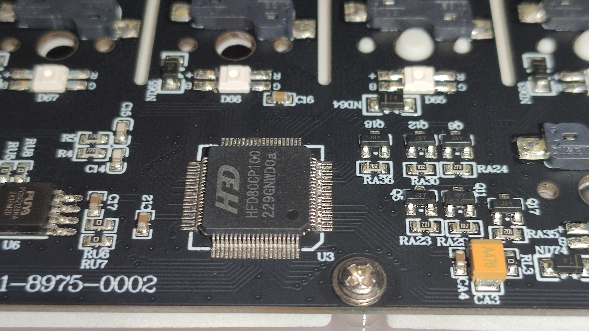
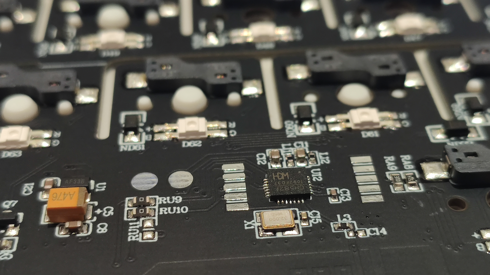
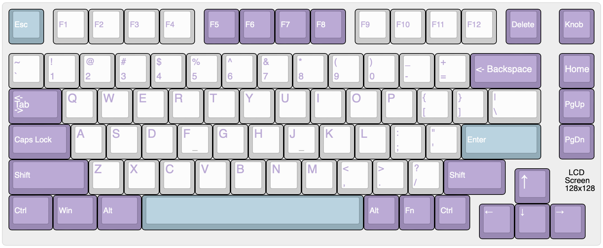
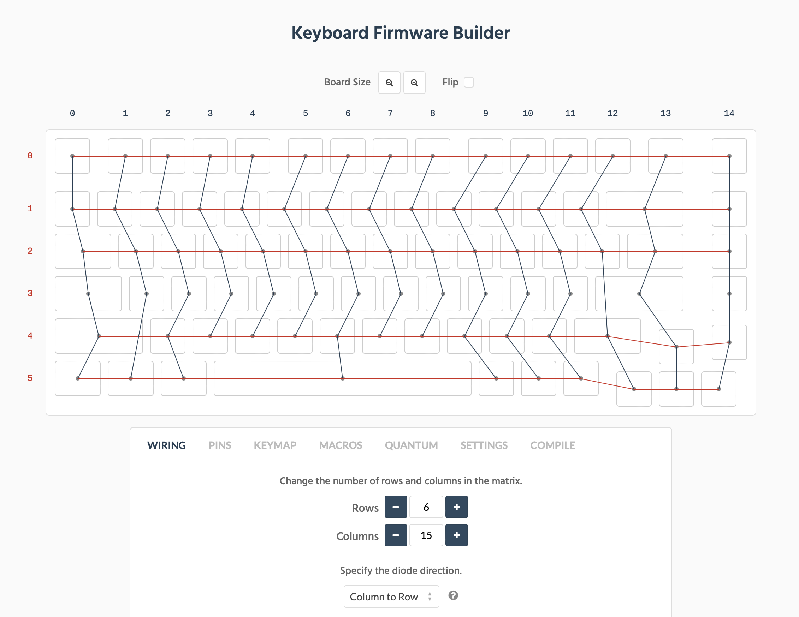
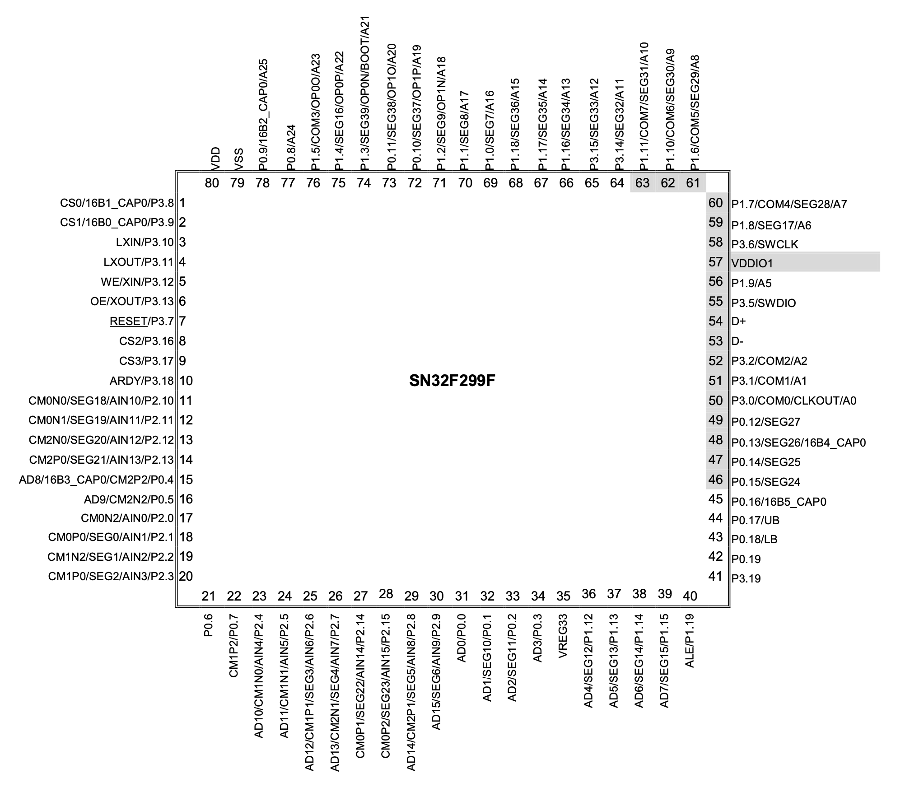
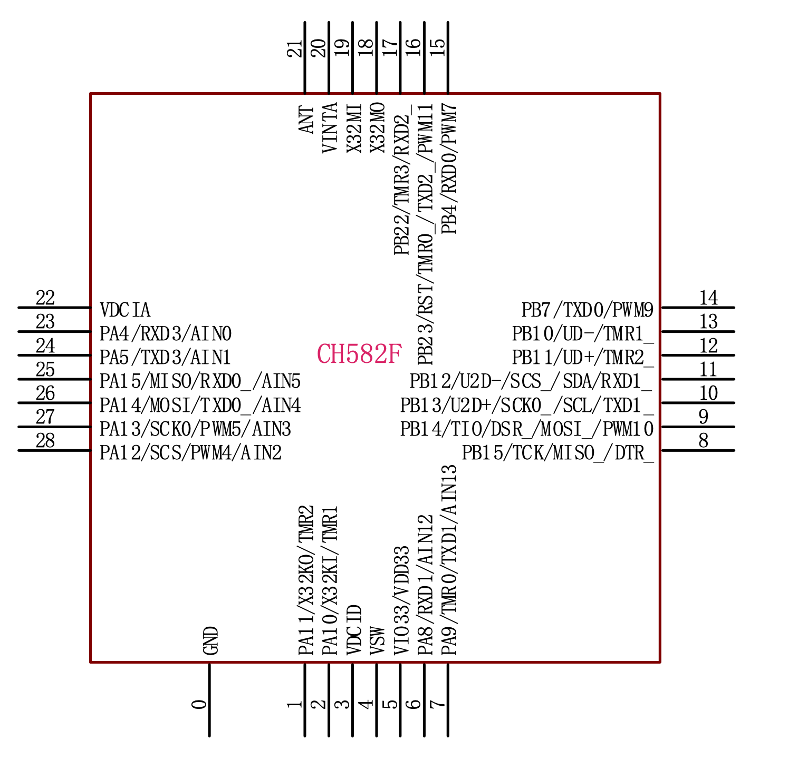
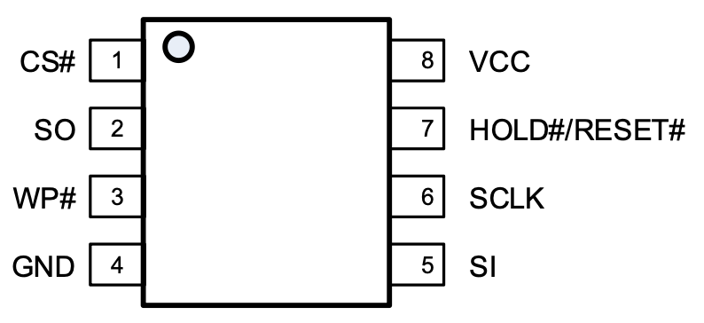
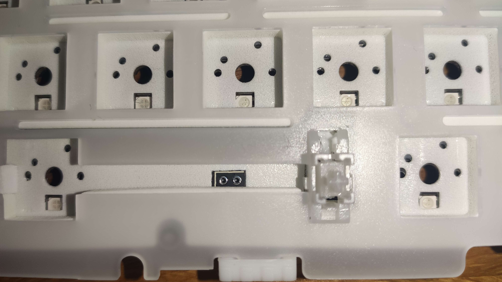

# AJAZZ AK820PRO reverse engineering

This is just a way to document my findings regarding the board of my AJAZZ AK820PRO (BT/USB/2.4G 81 keys)

## TODO List - Perhaps some kind souls will add QMK support for it
- [ ] map lcd module connections
- [ ] map status indicators' leds (Caps lock, Win lock)
- [ ] Mac/Win switch wiring

## Chips
* Main MCU - HFD80CP100 - appears to be based on/clone of [SONIX SN32F299](https://www.sonix.com.tw/article-jp-4797-43927)

* Bt module [WCH CH582F](https://www.wch-ic.com/products/CH583.html?)
  

* External 16MB flash module [PY25Q128HA](https://puyasemi.com/uploadfiles/2022/09/20220913130446446.pdf)

* LCD Module - 0.85" 128x128 [NFP085B-10AF](https://cdn.hackaday.io/files/1881838051221472/GC9107%20DataSheet%20V1.2.pdf)

## Wiring

### Key Matrix & MCU
[Keyboard Layout](http://www.keyboard-layout-editor.com/##@_name=AJAZZ%20AK820%20PRO&author=Fernando%20Birra&switchMount=cherry&plate:true%3B&@_c=%2393acb8&t=%23ffffff&a:6%3B&=Esc&_x:0.25&c=%23cccccc&t=%239989b3%3B&=F1&=F2&=F3&=F4&_x:0.25&c=%239989b3&t=%23cccccc%3B&=F5&=F6&=F7&=F8&_x:0.25&c=%23cccccc&t=%239989b3%3B&=F9&=F10&=F11&=F12&_x:0.25&c=%239989b3&t=%23cccccc%3B&=Delete&_x:0.5%3B&=Knob%3B&@_y:0.25&c=%23cccccc&t=%239989b3&a:4&fa@:4&:4%3B%3B&=~%0A%60&=!%0A1&=%2F@%0A2&=%23%0A3&=$%0A4&=%25%0A5&=%5E%0A6&=%2F&%0A7&=*%0A8&=(%0A9&=)%0A0&=%2F_%0A-&=+%0A%2F=&_c=%239989b3&t=%23cccccc&a:6&w:2%3B&=%3C-%20Backspace&_x:0.5%3B&=Home%3B&@_a:4&fa@:4&=undefined&:0&:0&:0&:0&=undefined%3B&w:1.5%3B&=%3C-%0A-%3E%0A%0A%0A%0A%0ATab&_c=%23cccccc&t=%239989b3&fa@:6%3B%3B&=Q&=W&=E&=R&=T&=Y&=U&=I&=O&=P&_fa@:4&:4%3B%3B&=%7B%0A%5B&=%7D%0A%5D&_w:1.5%3B&=%7C%0A%5C&_x:0.5&c=%239989b3&t=%23cccccc&a:6&f:3%3B&=PgUp%3B&@_f:3&w:1.75%3B&=Caps%20Lock&_c=%23cccccc&t=%239989b3&a:4&fa@:6%3B%3B&=A&=S&=D&_n:true%3B&=F&=G&=H&_n:true%3B&=J&=K&=L&_fa@:4&:4%3B%3B&=%2F:%0A%2F%3B&=%22%0A'&_c=%2393acb8&t=%23cccccc&a:6&f:3&w:2.25%3B&=Enter&_x:0.5&c=%239989b3&f:3%3B&=PgDn%3B&@_f:3&w:2.25%3B&=Shift&_c=%23cccccc&t=%239989b3&a:4&fa@:6%3B%3B&=Z&=X&=C&=V&=B&=N&=M&_fa@:4&:4%3B%3B&=%3C%0A,&=%3E%0A.&=%3F%0A%2F%2F&_c=%239989b3&t=%23cccccc&a:6&f:3&w:1.75%3B&=Shift%3B&@_y:-0.8499999999999996&x:15.5&c=%23cccccc&t=%23000000&a:5&f:3&d:true%3B&=LCD%0A128x128%0A%0A%0A%0A%0AScreen%3B&@_y:-0.9000000000000004&x:14.25&c=%239989b3&t=%23cccccc&a:4&fa@:9%3B%3B&=↑%3B&@_y:-0.25&a:6&f:3&w:1.25%3B&=Ctrl&_f:3&w:1.25%3B&=Win&_f:3&w:1.25%3B&=Alt&_c=%2393acb8&a:7&w:6.25%3B&=&_c=%239989b3&a:6&f:3%3B&=Alt&_f:3%3B&=Fn&_f:3%3B&=Ctrl%3B&@_y:-0.75&x:13.25&a:4&f:3%3B&=←&_f:3%3B&=↓&_f:3%3B&=→)

### MCU-Diagram - Keyboard matrix diagram on the MCU

| --- | col | C0 | C1 | C2 | C3 | C4 | C5 | C6 | C7 | C8 | C9 | C10 | C11 | C12 | C13 | C14 |
| --- | --- | -- | -- | -- | -- | -- | -- | -- | -- | -- | -- | --- | --- | --- | --- | --- |
| row | pin | 15 | 16 | 17 | 18 | 19 | 20 | 21 | 22 | 23 | 24 | 25  | 26  | 29  | 30  | 27  |
| R0  | 38  |    |    |    |    |    |    |    |    |    |    |     |     |     |     |     |
| R1  | 39  |    |    |    |    |    |    |    |    |    |    |     |     |     |     |     |
| R2  | 40  |    |    |    |    |    |    |    |    |    |    |     |     |     |     |     |
| R3  | 41  |    |    |    |    |    |    |    |    |    |    |     |     |     |     |     |
| R4  | 42  |    |    |    |    |    |    |    |    |    |    |     |     |     |     |     |
| R5  | 43  |    |    |    |    |    |    |    |    |    |    |     |     |     |     |     |

### MCU-Diagram - LED matrix

| --- |   r  |   b  |   g  | col | C0 | C1 | C2 | C3 | C4 | C5 | C6 | C7 | C8 | C9 | C10 | C11 | C12 | C13 | C14 | C15 | C16 | C17 | C18 |
| --- |  --- |  --- |  --- | --- | -- | -- | -- | -- | -- | -- | -- | -- | -- | -- | --  | --  | --  | --  | --  | --  | --  | --  | --  |
| row |  pin |  pin |  pin | pin | 25 | 26 | 27 | 28 | 29 | 30 | 31 | 32 | 34 | 35 | 36  | 37  | 38  | 39  | 40  | 41  | 42  | 43  | 44  |
| R0  |  73  |  75  |  76  |  38 | -- | -- | -- | -- | -- | -- | -- | -- | -- | -- | --- | --- | --- | --- | --- | --- | --- | --- | --- |
| R1  |  77  |  78  |  01  |  39 | -- | -- | -- | -- | -- | -- | -- | -- | -- | -- | --- | --- | --- | --- | --- | --- | --- | --- | --- |
| R2  |  02  |  03  |  04  |  40 | -- | -- | -- | -- | -- | -- | -- | -- | -- | -- | --- | --- | --- | --- | --- | --- | --- | --- | --- |
| R3  |  05  |  06  |  08  |  41 | -- | -- | -- | -- | -- | -- | -- | -- | -- | -- | --- | --- | --- | --- | --- | --- | --- | --- | --- |
| R4  |  09  |  10  |  11  |  42 | -- | -- | -- | -- | -- | -- | -- | -- | -- | -- | --- | --- | --- | --- | --- | --- | --- | --- | --- |
| R5  |  12  |  13  |  14  |  43 | -- | -- | -- | -- | -- | -- | -- | -- | -- | -- | --- | --- | --- | --- | --- | --- | --- | --- | --- |

Row RGB pins are connected to NPN transistors (C) - LED, (B) - GPIO, (E) - GND.
Col RGB pin is connected to PNP transistor (E) - VDD, (B) - GPIO, (C) - LED + 

### MCU-Diagram - mac/win and bt/off/cable dip switches

- Bluetooth Mode: pin 36 (active high)
- 2.4 Ghz Mode: pin 37 (active high)
- Win - Android / Mac - iOS Mode: pin 70 (0-Win, 1-Mac)

### MCU-Diagram - Status LED indicators
- Caps Lock (White LED): pin 71/72/73
- Num Lock (White LED): pin 71/72/73
- Charging (RED LED): Charging (RED): ON, Charged:OFF

positive side of CAPS/WIN/CHARGING indicator goes to 1K resistors. The other side I couldn't trace.
negative is common for all the 3 indicators and seems to be connected to MCU pins 71?/72/73 (??? This makes no sense to me)

## MCU Pinout - SN32F299

## Bluetooth module Pinout

### MCU-BT Module wiring
| MCU      |  BT                 |
|----------|---------------------|
|  61 SCL0 |  10 - SCL           |
|  60 SDA0 |  11 - SDA           |
|  ------- |  6 - RXD1           |
|  ------- |  7 - TXD1           |
|  ------- |  17- PB22/TMR3/RXD2 |

Near the BT module there are 10 pads (2x5) + 2 isolated rectangular pads. When looking at the CH582F chip upside down, the pins on the left are connected to the BT module like this (top to bottom):

1 - WCH Pin#10 - SCL
2 - WCH Pin#11 - SDA
3 - WCH Pin#6  - RXD1
4 - WCH Pin#7  - TXD1
5 - WCH Pin#17 - PB22/TMR3/RXD2

## Flash Pinout

### MCU-Flash Module wiring

| MCU        | Flash            |
|------------|------------------|
|  48 SEL1   |   1 CS#          |
|  62 MISO1  |   2 SO           |
|  71 P1.2   |   3 WP#          |
|            |   4 GND          |
|  63 MOSI1  |   5 SI           |
|  49 SCK1   |   6 SCLK         |
|  57 VDDIO1 |   7 HOLD#RESET#  |
|            |   8 VCC          |

## LCD Module pinout

Found several reverences to 8 pin connectors of these boards with the following pin labels: VCC, GND, DIN (Serial data in), CLK (Serial clk in), ~CS(Chip select), DC (Data/~Command selection), RST (~Reset) and BL (Backlight). No way to read data from the LCD?

Possible LCD connector pinout (from similar devices found on Aliexpress with 8 pins):

| LCD pin# | Description        |
|----------|--------------------|
|     1    | LED Anode          |
|     2    | Power GND          |
|     3    | RESET (active low) |
|     4    | Data/Command       |
|     5    | SDA                |
|     6    | SCL                |
|     7    | VDD                |
|     8    | CS (active low)    |

| MCU        | LCD Connector    |
|------------|------------------|
| 70 MISO0 0 |   1              | SCL0?
| 79 VSS     |   2 GND          |
| ??         |   3              |
| ??         |   4              |
| 52 MOSI0   |   5              | P3.2
| 50 SCK0    |   6 CLK          | P3.0
| 57 VDDIO1  |   7              |
| 59 SEL0    |   8              |

## Bootloader mode
There are two pins under the SPACE bar. They are covered by 2 insulation layers and 1 removable foam strip (there are two strips on each side of the space switch that are easily removable). Cutting a window on the 2 insulation layers will give access to the pins. Shorting them while connecting the USB cable will make the MCU enter bootloader mode. In this mode the USB VID/PID will be 0x0C45/0x7140.

