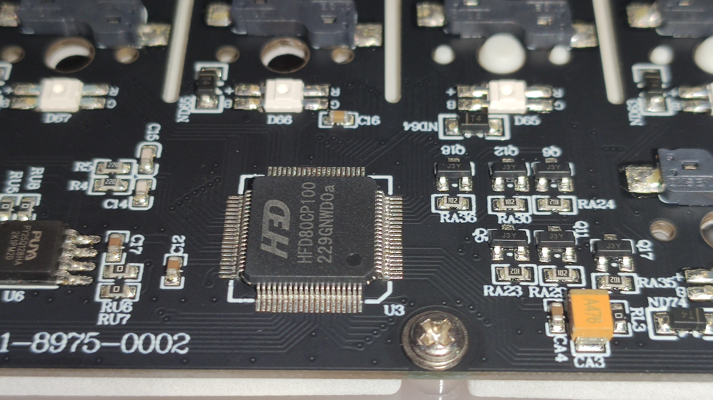
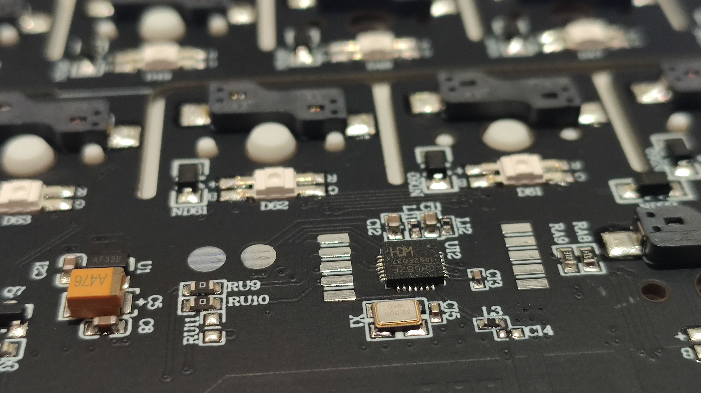
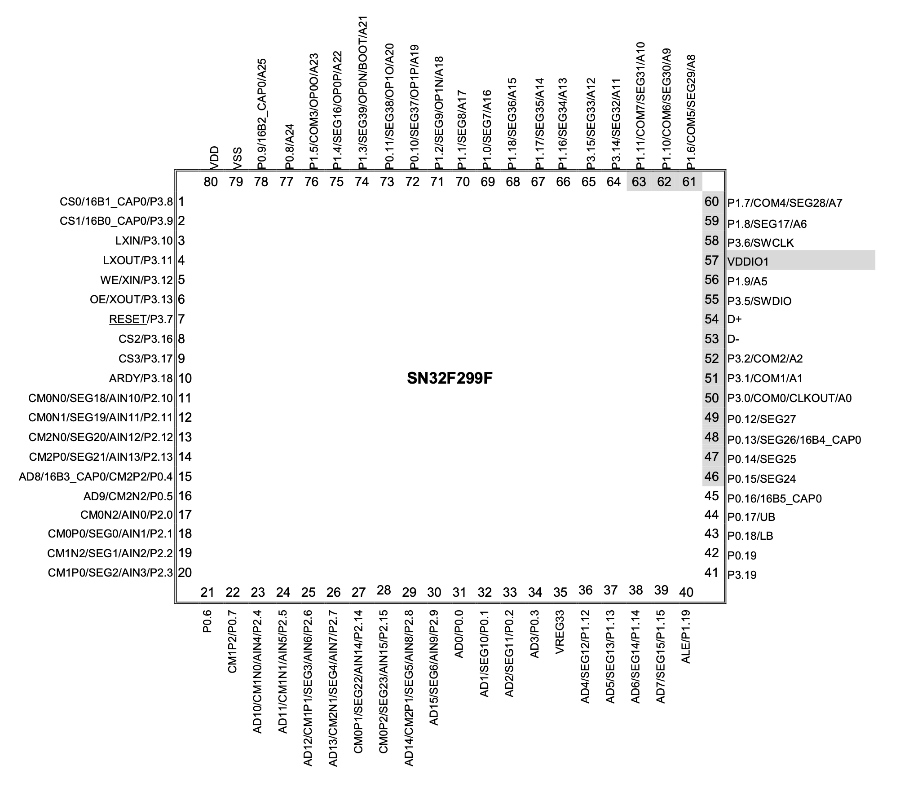
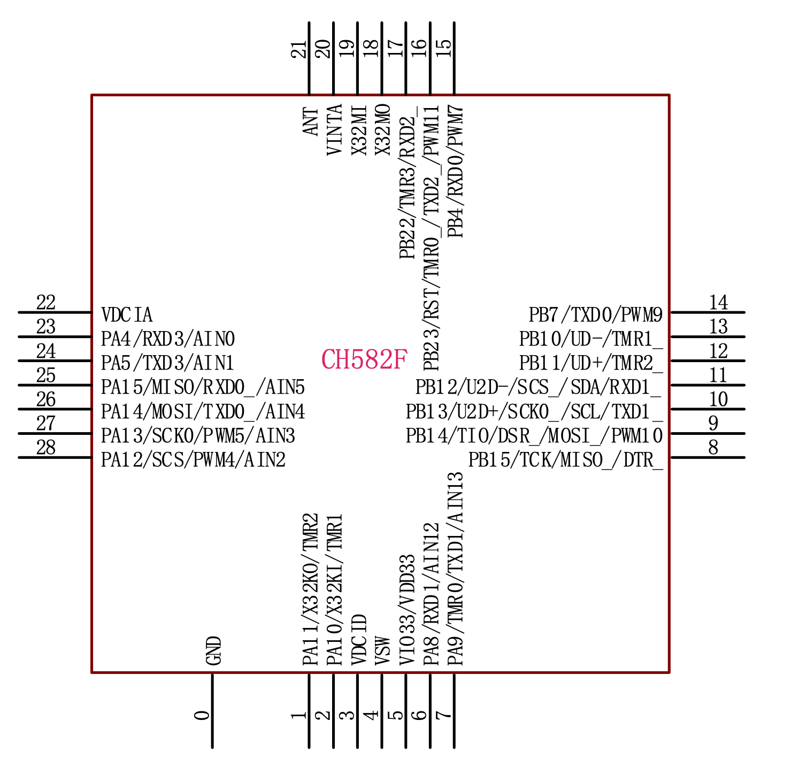
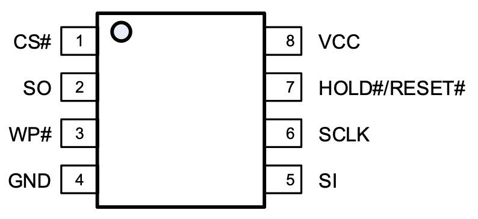
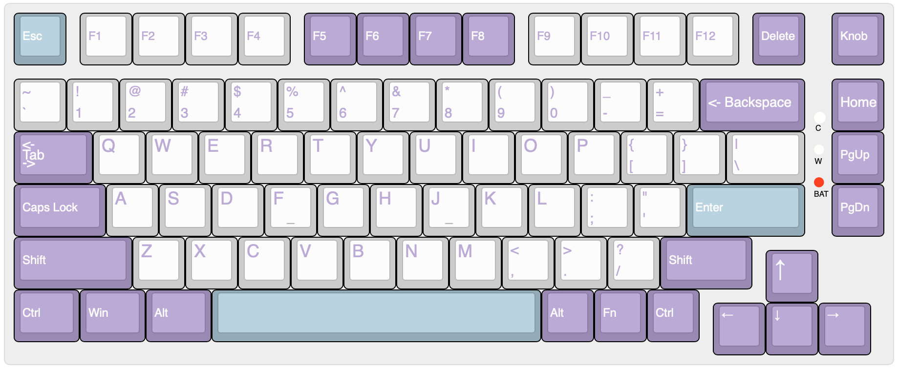
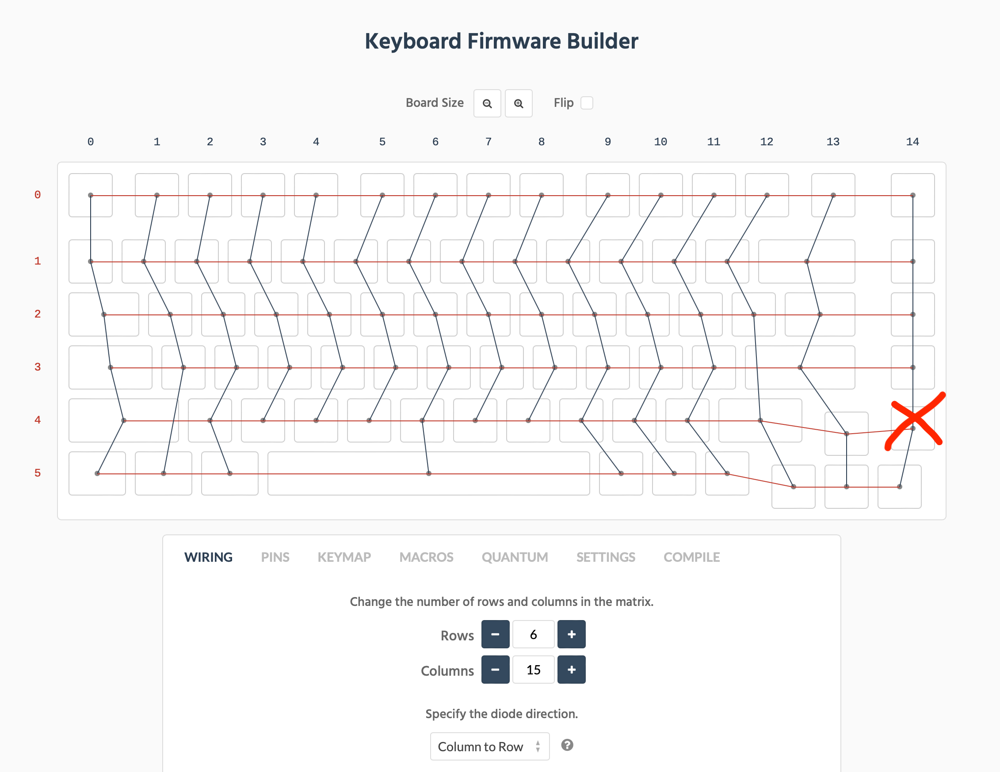
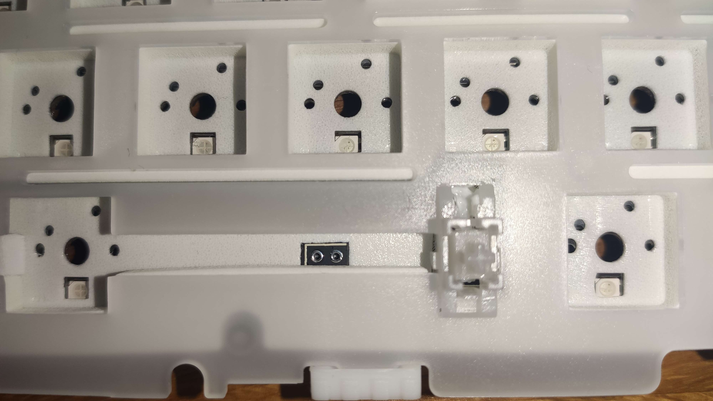

# AJAZZ AK820PRO reverse engineering

AJAZZ AK820PRO (BT/USB/2.4G 81 keys) Reverse Engineering for QMK port

# QMK Support Status

Everything below is supported. Two firmware branches are worth knowing about:

- [`ak820pro-full`](https://github.com/fpb/qmk_firmware/tree/ak820pro-full) — the
  full-featured build with the LCD art embedded in the firmware image. It uses Quantum Painter to display.
- [`ak820pro-flashlcd-tiles`](https://github.com/fpb/qmk_firmware/tree/ak820pro-flashlcd-tiles) — the dashboard runs on pre-rendered RGB565 tiles served from external SPI flash, so the LCD art (and GIF animations) is provisioned to flash from the host instead of baked into firmware. Quantum Painter is not used.

HW Support Status:

- [x] key matrix
- [x] LED indicators
- [x] LCD display
- [x] Dip switches
- [x] Volume Knob
- [x] Wireless support (BT/2.4G) — custom CH582F driver with ACK/retry reliability
- [x] Clock support
- [x] RGB leds (per-key, hardware PWM across CT16B0/B1/B2)
- [x] Flash Memory — LCD assets **and** GIF animations, provisioned over HID (`tiles` branch)

Host toolkit: [**ak820ctl**](https://github.com/fpb/time-util-ak820pro) sets the LCD
clock and (on the `tiles` branch) builds and flashes the LCD image assets and GIF
animations into external flash. It replaces the old `set-clock` utility.

## QMK Firmware

- Look under the [QMKBinaries](https://github.com/fpb/ajazz-ak820-pro/tree/main/QMKFWBinaries) folder

## Chips
* Main MCU - HFD80CP100 - based on/clone of [SONIX SN32F299](https://www.sonix.com.tw/webapi/fl219869/SN32F299_V1.8_EN.pdf)

* Bt module [WCH CH582F](https://www.wch-ic.com/products/CH583.html?)
  

* External 16MB flash module [PY25Q128HA](https://puyasemi.com/uploadfiles/2022/09/20220913130446446.pdf)

* LCD Module - 0.85" 128x128 [NFP085B-10AF](https://cdn.hackaday.io/files/1881838051221472/GC9107%20DataSheet%20V1.2.pdf)

* RTC clock: CHMC D8563F (clone of PCF8563)
(thanks to https://hwbusters.com/peripherals/epomaker-th80-v2-pro-mechanical-keyboard-review/4/ for tracking the RTC chip)

## Pinouts

### MCU Pinout - SN32F299

### Bluetooth module Pinout

### Flash Pinout

### LCD Module pinout

Found several reverences to 8 pin connectors of these boards with the following pin labels: VCC, GND, DIN (Serial data in), CLK (Serial clk in), ~CS(Chip select), DC (Data/~Command selection), RST (~Reset) and BL (Backlight). 

Possible LCD connector pinout (from similar devices found on Aliexpress with 8 pins):

| LCD pin# | Description        |
|----------|--------------------|
|     1    | LED Anode          |
|     2    | Power GND          |
|     3    | RESET (active low) |
|     4    | Data/Command       |
|     5    | SDA                |
|     6    | SCL                |
|     7    | VDD                |
|     8    | CS (active low)    |

## Wiring

### RTC clock

Needs I2C bit bang because pins used are not I2C hardware compatible on MCU. Fortunately, one reads the clock at boot and keep it updated internally. Only other time that we need to talk to the RTC chip is to set the date via HID utility.

|RTC |  MCU  |
|----|-------|
|SDA | P0.15 |
|SCL | P0.14 |

### Encoder

| Pin | MCU      |
|-----|----------|
| SW1 | 30/P2.9  |
| SW2 | 38/P1.14 |
| A   | 71/P1.2  |
| C   | GND      |
| B   | 72/P0.10 |

Switch is part of the key matrix

### Key Matrix & MCU
[Keyboard Layout](https://www.keyboard-layout-editor.com/##@_name=AJAZZ%20AK820%20PRO&author=Fernando%20Birra&switchMount=cherry&plate:true%3B&@_c=%2393acb8&t=%23ffffff&a:6%3B&=Esc&_x:0.25&c=%23cccccc&t=%239989b3%3B&=F1&=F2&=F3&=F4&_x:0.25&c=%239989b3&t=%23cccccc%3B&=F5&=F6&=F7&=F8&_x:0.25&c=%23cccccc&t=%239989b3%3B&=F9&=F10&=F11&=F12&_x:0.25&c=%239989b3&t=%23cccccc%3B&=Delete&_x:0.5%3B&=Knob%3B&@_y:0.25&x:1&c=%23cccccc&t=%239989b3&a:4&fa@:4&:4%3B%3B&=!%0A1&=%2F@%0A2&=%23%0A3&=$%0A4&=%25%0A5&=%5E%0A6&=%2F&%0A7&=*%0A8&=(%0A9&=)%0A0&=%2F_%0A-&=+%0A%2F=&_c=%239989b3&t=%23cccccc&a:6&w:2%3B&=%3C-%20Backspace&_x:0.5%3B&=Home%3B&@_y:-0.75&c=%23cccccc&t=%239989b3&a:4%3B&=~%0A%60%3B&@_y:-0.75&x:15&t=%23ffffff%0A%23000000&a:5&fa@:4&:1%3B&w:0.5&h:0.75&d:true%3B&=%3Ci%20class%2F='fa%20fa-circle'%3E%3C%2F%2Fi%3E%0AC%3B&@_y:-0.5&c=%239989b3&t=%23cccccc&a:4&fa@:4&=undefined&:0&:0&:0&:0&=undefined%3B&w:1.5%3B&=%3C-%0A-%3E%0A%0A%0A%0A%0ATab&_c=%23cccccc&t=%239989b3&fa@:6%3B%3B&=Q&=W&=E&=R&=T&=Y&=U&=I&=O&=P&_fa@:4&:4%3B%3B&=%7B%0A%5B&=%7D%0A%5D&_w:1.5%3B&=%7C%0A%5C&_x:0.5&c=%239989b3&t=%23cccccc&a:6&f:3%3B&=PgUp%3B&@_y:-0.875&x:15&c=%23cccccc&t=%23ffffff%0A%23000000&a:5&f2:1&w:0.5&h:0.75&d:true%3B&=%3Ci%20class%2F='fa%20fa-circle'%3E%3C%2F%2Fi%3E%0AW%3B&@_y:-0.375&x:15&t=%23ff0000%0A%23000000&w:0.5&h:0.75&d:true%3B&=%3Ci%20class%2F='fa%20fa-circle'%3E%3C%2F%2Fi%3E%0ABAT%3B&@_y:-0.75&c=%239989b3&t=%23cccccc&a:6&w:1.75%3B&=Caps%20Lock&_c=%23cccccc&t=%239989b3&a:4&fa@:6%3B%3B&=A&=S&=D&_n:true%3B&=F&=G&=H&_n:true%3B&=J&=K&=L&_fa@:4&:4%3B%3B&=%2F:%0A%2F%3B&=%22%0A'&_c=%2393acb8&t=%23cccccc&a:6&f:3&w:2.25%3B&=Enter&_x:0.5&c=%239989b3&f:3%3B&=PgDn%3B&@_f:3&w:2.25%3B&=Shift&_c=%23cccccc&t=%239989b3&a:4&fa@:6%3B%3B&=Z&=X&=C&=V&=B&=N&=M&_fa@:4&:4%3B%3B&=%3C%0A,&=%3E%0A.&=%3F%0A%2F%2F&_c=%239989b3&t=%23cccccc&a:6&f:3&w:1.75%3B&=Shift%3B&@_y:-0.75&x:14.25&a:4&fa@:9%3B%3B&=↑%3B&@_y:-0.25&a:6&f:3&w:1.25%3B&=Ctrl&_f:3&w:1.25%3B&=Win&_f:3&w:1.25%3B&=Alt&_c=%2393acb8&a:7&w:6.25%3B&=&_c=%239989b3&a:6&f:3%3B&=Alt&_f:3%3B&=Fn&_f:3%3B&=Ctrl%3B&@_y:-0.75&x:13.25&a:4&f:3%3B&=←&_f:3%3B&=↓&_f:3%3B&=→)

### MCU-Diagram - Keyboard matrix diagram on the MCU ✅

| --- | col       | C0 | C1 | C2 | C3 | C4 | C5 | C6 | C7 | C8 | C9 | C10 | C11 | C12 | C13 | C14 |
| --- | --------- | -- | -- | -- | -- | -- | -- | -- | -- | -- | -- | --- | --- | --- | --- | --- |
| row | pin       | 15 | 16 | 17 | 18 | 19 | 20 | 21 | 22 | 23 | 24 | 25  | 26  | 27  | 29  | 30  |
| R0  | 38/P1.14  |    |    |    |    |    |    |    |    |    |    |     |     |     |     |     |
| R1  | 39/P1.15  |    |    |    |    |    |    |    |    |    |    |     |     |     |     |     |
| R2  | 40/P1.19  |    |    |    |    |    |    |    |    |    |    |     |     |     |     |     |
| R3  | 41/P3.19  |    |    |    |    |    |    |    |    |    |    |     |     |     |     |     |
| R4  | 42/P0.19  |    |    |    |    |    |    |    |    |    |    |     |     |     |     |     |
| R5  | 43/P0.18  |    |    |    |    |    |    |    |    |    |    |     |     |     |     |     |

### MCU-Diagram - LED matrix 
(connections not tested in firmware yet)

| --- |   r  |   b  |   g  | col | C0 | C1 | C2 | C3 | C4 | C5 | C6 | C7 | C8 | C9 | C10 | C11 | C12 | C13 | C14 |
| --- |  --- |  --- |  --- | --- | -- | -- | -- | -- | -- | -- | -- | -- | -- | -- | --  | --  | --  | --  | --  |
| row |  pin |  pin |  pin | pin | 15 | 16 | 17 | 18 | 19 | 20 | 21 | 22 | 23 | 24 | 25  | 26  | 27  | 29  | 30  |
| R0  |  73  |  75  |  76  |  38 | -- | -- | -- | -- | -- | -- | -- | -- | -- | -- | --- | --- | --- | --- | --- |
| R1  |  77  |  78  |  01  |  39 | -- | -- | -- | -- | -- | -- | -- | -- | -- | -- | --- | --- | --- | --- | --- |
| R2  |  02  |  03  |  04  |  40 | -- | -- | -- | -- | -- | -- | -- | -- | -- | -- | --- | --- | --- | --- | --- |
| R3  |  05  |  06  |  08  |  41 | -- | -- | -- | -- | -- | -- | -- | -- | -- | -- | --- | --- | --- | --- | --- |
| R4  |  09  |  10  |  11  |  42 | -- | -- | -- | -- | -- | -- | -- | -- | -- | -- | --- | --- | --- | --- | --- |
| R5  |  12  |  13  |  14  |  43 | -- | -- | -- | -- | -- | -- | -- | -- | -- | -- | --- | --- | --- | --- | --- |

Row RGB pins are connected to NPN transistors (C) - LED, (B) - GPIO, (E) - GND.
Col RGB pin is connected to PNP transistor (E) - VDD, (B) - GPIO, (C) - LED + 

### MCU-Diagram - mac/win and bt/off/cable dip switches

- Bluetooth Mode: pin 36/P1.12 (active high)
- 2.4 Ghz Mode: pin 37/P1.13 (active high)
- Win - Android / Mac - iOS Mode: pin 70/P1.1 (0-Win, 1-Mac)

### MCU-Diagram - Status LED indicators

Connections to indicator LEDs is as follows:

MCU PIN --> 1K Resistor --> -(+)LED(-)-- GND

| MCU PIN  | Indicator |
|----------|-----------|
| 65/P3.15 | CAPS LOCK |
| 28/P2.15 | WIN LOCK  |
| 68/P1.18 | Charging  |

### MCU-BT Module wiring
| MCU             |  BT                                |    Notes     |
|-----------------|------------------------------------|--------------|
|  61 URXD2/URXD3 |  10 - PB13/U2D+/SCK0_/SCL/TXD1_    |  P1.6 (B6)   |18,B12
|  60 UTXD2/UTXD3 |  11 - PB12/U2D-/SCK0_/SDA/RXD1_    |  P1.7 (B7)   |
|  -------        |  6 - PA8/RXD1/AIN12                |              |
|  -------        |  7 - PA9/TMR0/TXD1/AIN13           |              |
|  -------        |  17- PB22/TMR3/RXD2_               |              |

Near the BT module there are 10 pads (2x5) + 2 isolated rectangular pads. When looking at the CH582F chip upside down, the pins on the left are connected to the BT module like this (top to bottom):

1 - WCH Pin#10 - SCL
2 - WCH Pin#11 - SDA
3 - WCH Pin#6  - RXD1
4 - WCH Pin#7  - TXD1
5 - WCH Pin#17 - PB22/TMR3/RXD2

### MCU-Flash Module wiring

| MCU        | Flash            | Notes.     |
|------------|------------------|------------|
|  48 SEL1   |   1 CS#          |P0.13 (A13) |
|  62 MISO1  |   2 SO           |P1.10 (B10) |
|  71 MOSI0   |   3 WP#         | P1.2 (B2)  |
|            |   4 GND          |            |
|  63 MOSI1  |   5 SI           | P1.11 (B11)|
|  49 SCK1   |   6 SCLK         | P0.12 (A12)|
|  57 VDDIO1 |   7 HOLD#RESET#  |            |
|            |   8 VCC          |            |

## LCD Module wiring

Discovered connections between LCD connector and MCU:

| MCU                             | LCD Connector    |    Notes                    |
|---------------------------------|------------------|-----------------------------|
| 45/P0.16 (100 Ohm Resistor)     |   1 LED Anode    | 100 Ohm Resistor            |
| 79/VSS                          |   2 GND          |                             |
| 44/P0.17                        |   3 ~RESET       | Schottky Diode + 10K Pullup |
| 64/P3.14                        |   4 D/C          | Schottky Diode + 10K Pullup |
| 52/MOSI0/P3.2                   |   5 SDA          |                             |
| 50/SCK0/P3.0                    |   6 CLK          |                             |
| 57/VDDIO1                       |   7 VDD          |                             |
| 59/SEL0/P1.8                    |   8 ~CS          |     P1.8 (B8)               |

## Bootloader mode
There are two pins under the SPACE bar. They are covered by 2 insulation layers and 1 removable foam strip (there are two strips on each side of the space switch that are easily removable). Cutting a window on the 2 insulation layers will give access to the pins. Shorting them while connecting the USB cable will make the MCU enter bootloader mode. In this mode the USB VID/PID will be 0x0C45/0x7140.

